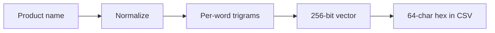

# Name Search Fingerprinting (`uc_name_searching_algorithm_1`)

## Overview

The preprocessing pipeline enriches each `products.csv` with a `uc_name_searching_algorithm_1` column containing a **256-bit trigram fingerprint** of the product name. This fingerprint enables fast, fuzzy product name search on the backend.

## Requirements

The fingerprint was designed to satisfy all of the following search requirements simultaneously:

| Requirement | Description | Example |
|---|---|---|
| **Word reorder** | Same words in any order match perfectly | "Cedevita limun 500g" = "500g limun Cedevita" |
| **Word subset** | Partial queries match via containment | "cedevita 500g" is found inside "Cedevita limun 500g" |
| **Typo tolerance** | Misspelled queries still produce high similarity | "Cedevota limun 500g" ~ "Cedevita limun 500g" |
| **Subset + typos** | Partial queries with typos still rank highly | "cedevota 500g" ~ "Cedevita limun 500g" |
| **Fast backend** | Comparison is bitwise arithmetic, sub-millisecond for 100k products | Brute-force scan, no index needed |

## Algorithm

The fingerprint is computed in four steps:



### Step 1: Normalize

`normalize_croatian_text(name)` prepares the raw product name:

1. **Lowercase** the entire string
2. **Strip Croatian diacritics**: č/ć → c, š → s, ž → z, đ → d
3. **Remove punctuation** (keep only alphanumeric characters and spaces)
4. **Collapse whitespace** and trim
5. **Sort words alphabetically** (makes the fingerprint word-order-invariant)

Example:

```
"CEDEVITA® Naranča 500g"  →  "500g cedevita naranca"
```

### Step 2: Generate per-word trigrams

Each word is **individually padded** with sentinel spaces and split into character trigrams. Per-word generation ensures that a subset of words always produces a strict subset of trigrams, which is critical for partial-query containment.

Example for word "cedevita":

```
padded: "  cedevita  "
trigrams: ["  c", " ce", "ced", "ede", "dev", "evi", "vit", "ita", "ta ", "a  "]
```

For multiple words, trigrams from all words are combined into a single collection.

### Step 3: Compute 256-bit vector

Each trigram is hashed (FNV-1a 64-bit) and mapped to one of 256 bit positions. That bit is set in the output vector. This is a feature-hashing / Bloom-filter approach: the bit vector records **which trigrams are present** in the name.

```
trigram "ced" → hash → bit position 42 → set bit 42
trigram "ede" → hash → bit position 187 → set bit 187
...
```

### Step 4: Encode as hex

The 256-bit vector (4 × u64) is encoded as a 64-character zero-padded hexadecimal string for storage in the CSV column.

## Similarity Metrics

On the backend, decode the hex string back into a 256-bit vector and use bitwise operations to compare:

### Containment (exact word-subset matching)

Check whether all query trigram bits are present in the product:

```
contains = (query_bits AND product_bits) == query_bits
```

Use this for strict partial matching (no typos).

### Overlap ratio (typo-tolerant matching)

Fraction of query bits that are found in the product:

```
overlap = popcount(query_bits AND product_bits) / popcount(query_bits)
```

Returns 0.0 to 1.0. This is the **recommended general-purpose metric** as it handles all cases: full matches, partial queries, and typos.

### Jaccard similarity (symmetric similarity)

Standard set similarity between two fingerprints:

```
jaccard = popcount(a AND b) / popcount(a OR b)
```

Useful for comparing two products against each other (e.g., finding duplicates).

## Benchmark Results

Measured against product **"Cedevita limun 500g"**:

| Query | Overlap | Jaccard |
|---|---|---|
| "500g limun Cedevita" (word reorder) | 1.000 | **1.000** |
| "cedevita 500g" (word subset) | 1.000 | **0.600** |
| "Cedevota limun 500g" (1 typo) | 0.864 | **0.760** |
| "cedevota 500g" (subset + typo) | 0.800 | -- |
| "Toaletni papir troslojni 8 rola" (unrelated) | 0.094 | **0.059** |

### Why overlap outperforms Jaccard for ranking

Query **"Barila"** (single word, 8 fingerprint bits) measured against real products:

| Product | Overlap | Jaccard | Bits |
|---|---|---|---|
| BASILIKO BARILA | 1.000 | 0.500 | 16 |
| Barilla Spaghetti, 500g | 1.000 | 0.333 | 24 |
| UMAK BOSILJAK 400G BARILA | 1.000 | 0.320 | 25 |
| Barilla Pesto Rosso | 0.875 | 0.333 | 20 |
| Barilla Umak Bolognese | 0.875 | 0.292 | 23 |
| **Skuša** (false positive) | **0.500** | **0.364** | 7 |
| SKUSA PECENA (false positive) | 0.625 | 0.294 | 14 |

Jaccard ranks "Skuša" (0.364) **above** most real Barilla products (0.286-0.333) because
its short name (7 bits) keeps the union denominator small. Overlap correctly separates
genuine matches (0.875-1.000) from collision-based false positives (0.500-0.625).

Recommended strategy: filter candidates with **overlap >= 0.65**, then rank by **overlap descending**
(with Jaccard as a tiebreaker). A secondary floor of **Jaccard >= 0.2** removes residual noise.
See the [Backend Usage](#searching-products) section below for rationale.

## Backend Usage

### Computing the query fingerprint

The backend must apply the **exact same algorithm** (normalize, per-word trigrams, bit vector) to the user's search query. The algorithm is ~80 lines of code with no dependencies, easily portable to any language.

### Searching products

Recommended two-step strategy -- overlap filters candidates, overlap ranks them:

```
1. Compute query_bits from user input
2. For each product:
   a. overlap = popcount(query & product) / popcount(query)
   b. If overlap >= 0.65, keep as candidate
3. For each candidate:
   a. jaccard = popcount(query & product) / popcount(query | product)
   b. If jaccard < 0.2, discard (removes residual noise)
4. Sort candidates by overlap descending, then jaccard descending as tiebreaker
5. Return top-k results
```

Why overlap for ranking (not Jaccard):

- **Jaccard** penalizes extra unmatched content in the product. This is desirable for
  multi-word queries ("barilla spaghetti" correctly ranks "Barilla Spaghetti 500g" above
  "Barilla Pesto Genovese"). However, for short single-word queries it backfires:
  products with short names and a few hash collisions can outscore genuine matches
  with longer names. For example, querying "Barila" gives "Skuša" (5 chars, 7 bits)
  Jaccard 0.364, but "Barilla Spaghetti, 500g" (a real match) only Jaccard 0.333
  because its 24-bit fingerprint inflates the union denominator.

- **Overlap ratio** asks "what fraction of the query's trigrams are present in the
  product?" -- this correctly identifies genuine matches regardless of product name
  length. "Barilla Spaghetti, 500g" scores overlap 1.000 (all query trigrams present),
  while "Skuša" scores only 0.500 (only hash collisions). This makes overlap a more
  robust primary ranking signal.

- The **overlap >= 0.65 threshold** eliminates hash-collision false positives for short
  queries while keeping genuine matches. With 256 bits and typical product names
  setting 15-30 bits, random overlap with an 8-bit query is ~0.35-0.50 in expectation,
  so 0.65 sits comfortably above the noise floor. For the "Barila" example, this
  filters out "Skuša" (0.500) and "SKUSA PECENA" (0.625) while keeping all real
  Barilla products (0.875-1.000).

- **Jaccard as a tiebreaker** still helps within groups of equally high overlap:
  among products that all score overlap 1.000, "CEDEVITA 500g" ranks above
  "CEDEVITA VIN NARANČA 900g" because of tighter Jaccard.

### Python example

Both Rust and Python use the same hash function (FNV-1a 64-bit), so the
precomputed `uc_name_searching_algorithm_1` hex values in the CSV are directly
usable from Python -- no recomputation needed. The backend only computes a
fingerprint for the **query** at search time.

```python
import csv

BITVEC_BITS = 256

# --- FNV-1a 64-bit (identical to the Rust implementation) ---

FNV_OFFSET = 0xCBF29CE484222325
FNV_PRIME = 0x100000001B3
MASK64 = 0xFFFFFFFFFFFFFFFF


def fnv1a_64(data: bytes) -> int:
    h = FNV_OFFSET
    for b in data:
        h ^= b
        h = (h * FNV_PRIME) & MASK64
    return h


# --- Normalize (same logic as Rust's normalize_croatian_text) ---

CROATIAN_MAP = str.maketrans("čćšžđČĆŠŽĐ", "ccszd" "CCSZD")


def normalize(name: str) -> str:
    lowered = name.lower().translate(CROATIAN_MAP)
    cleaned = "".join(c if c.isalnum() or c == " " else " " for c in lowered)
    words = sorted(cleaned.split())
    return " ".join(words)


# --- Per-word trigrams (same logic as Rust's generate_trigrams) ---


def trigrams(text: str) -> list[str]:
    result = []
    for word in text.split():
        padded = f"  {word}  "
        result.extend(padded[i : i + 3] for i in range(len(padded) - 2))
    return result


# --- Compute fingerprint for a query string ---


def compute_fingerprint(name: str) -> int:
    norm = normalize(name)
    if not norm:
        return 0
    bv = 0
    for tg in trigrams(norm):
        bit_pos = fnv1a_64(tg.encode("utf-8")) % BITVEC_BITS
        bv |= 1 << bit_pos
    return bv


# --- Read a precomputed fingerprint from the CSV hex column ---


def hex_to_int(hex_str: str) -> int:
    if not hex_str:
        return 0
    return int(hex_str, 16)


# --- Comparison ---


def popcount(n: int) -> int:
    return bin(n).count("1")


def overlap_ratio(product_bv: int, query_bv: int) -> float:
    if query_bv == 0:
        return 0.0
    return popcount(product_bv & query_bv) / popcount(query_bv)


def jaccard(a: int, b: int) -> float:
    union = popcount(a | b)
    if union == 0:
        return 0.0
    return popcount(a & b) / union


# --- Search ---


class ProductSearcher:
    """Load products once at startup, search by query at request time."""

    def __init__(self, products_csv_path: str):
        self.products: list[dict] = []
        self.fingerprints: list[int] = []

        with open(products_csv_path, newline="", encoding="utf-8") as f:
            for row in csv.DictReader(f):
                self.products.append(row)
                fp_hex = row.get("uc_name_searching_algorithm_1", "")
                self.fingerprints.append(hex_to_int(fp_hex))

    def search(
        self, query: str, threshold: float = 0.4, top_k: int = 10
    ) -> list[tuple[dict, float]]:
        query_bv = compute_fingerprint(query)
        if query_bv == 0:
            return []

        # Step 1: filter by overlap ratio (are the query trigrams present?)
        # Step 2: rank by Jaccard (tighter matches rank higher)
        candidates = []
        for product, fp in zip(self.products, self.fingerprints):
            if overlap_ratio(fp, query_bv) >= threshold:
                score = jaccard(query_bv, fp)
                candidates.append((product, score))

        candidates.sort(key=lambda x: x[1], reverse=True)
        return candidates[:top_k]


# --- Usage ---

searcher = ProductSearcher("cleaned_data/konzum/products.csv")

query = "cedevita 500g"
results = searcher.search(query)

for product, score in results:
    print(f"{score:.3f}  {product['name']}")
```

### Performance

All operations are bitwise (AND, OR, popcount) on 256 bits:

| Dataset size | Brute-force scan time |
|---|---|
| 10,000 products | ~10–50 microseconds |
| 100,000 products | ~100–500 microseconds |
| 1,000,000 products | ~1–2 milliseconds |

No index structure is needed. Linear scan is sufficient for retail-scale data.

> Python's `int` handles 256-bit integers natively. For higher throughput, fingerprints
> can be stored as NumPy `uint64` arrays (4 per product) and compared with vectorized
> bitwise operations.

## Limitations

- **Not semantic**: "mlijeko" (milk) and "milk" will not match. The fingerprint captures character-level surface similarity, not meaning.
- **Short queries** (1-2 characters): Too few trigrams to produce a discriminating fingerprint. Recommend a minimum query length of 3 characters.
- **Hash collisions**: With 256 bits and ~20-30 trigrams per product, occasional collisions are possible but rare. They may cause slight false-positive overlap but do not affect ranking quality in practice.

## Column Format

| Property | Value |
|---|---|
| Column name | `uc_name_searching_algorithm_1` |
| File | `products.csv` (in cleaned output) |
| Format | 64-character hexadecimal string |
| Bit width | 256 bits |
| Empty value | Empty string (for products with no usable name) |

## Source Code

The implementation lives in `src/embeddings/`:

| File | Purpose |
|---|---|
| `mod.rs` | Module root, re-exports `compute_name_hash` |
| `normalization.rs` | `normalize_croatian_text()` — text cleaning and word sorting |
| `trigrams.rs` | `generate_trigrams()` — per-word character trigram generation |
| `simhash.rs` | `compute_bitvec()`, `bitvec_to_hex()`, `compute_name_hash()`, plus comparison utilities |
